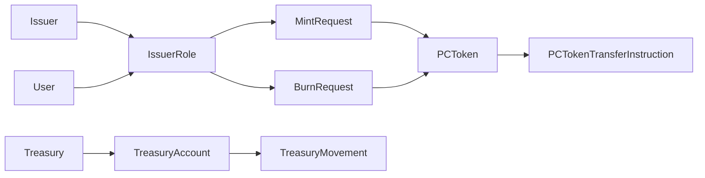

# Zivoe Canton Prototype

A Daml prototype for private credit tokenization on Canton Network. The model
represents a Zivoe-issued private credit NAV token, user mint and burn workflows,
USDCx settlement checks, and a treasury control surface for off-chain
tokenization movements.

The codebase is intentionally small: the `Zivoe` modules contain the application
contracts, while the `Cip56` modules provide standard-style interfaces for
holdings, transfer instructions, allocations, and metadata.

## What This Prototype Models



At a high level:

- The issuer publishes the token configuration, current NAV price, and permitted
  requesters through `IssuerRole`.
- A permitted user independently creates either a `MintRequest` or `BurnRequest`
  from the issuer-published role.
- The issuer accepts the request only after validating the matching USDCx
  transfer instruction or allocation.
- Successful mints create `PCToken` holdings. Successful burns consume
  `PCToken` holdings and validate the user's USDCx proceeds.
- Treasury movements record controlled USDCx pulls for off-chain tokenization
  activity.

## Application Contracts

### `IssuerRole`

`IssuerRole` is the issuer's standing authority contract for a token program.
It stores the active `TokenConfig`, current NAV `Price`, and the parties who
can see the role and independently submit mint or burn requests.

Key behavior:

- `UpdatePrice` archives the current role and creates a replacement with a new
  valid NAV price.
- `RequestMint` lets an authorized requester create a `MintRequest` after
  checking price effectiveness, positive USDCx input, positive minimum output,
  and slippage.
- `RequestBurn` lets an authorized requester create a `BurnRequest` after
  checking price effectiveness, positive token input, positive minimum output,
  and slippage.

Requests created from the role include deterministic references like
`mint:<price-id>:<nonce>` and `burn:<price-id>:<nonce>` so settlement flows can
be correlated through metadata.

The issuer is the signatory. The treasury and configured requesters observe the
role, which is what allows users to exercise the request choices directly in
Daml.

### `MintRequest`

`MintRequest` represents a user's intent to buy NAV tokens with USDCx. The user
signs the request; the issuer and treasury observe it.

Key behavior:

- `CancelMintRequest` lets the user cancel before acceptance.
- `RejectMintRequest` lets the issuer reject the request.
- `AcceptMintRequest` accepts a CIP-56 `TransferInstruction` for the user's
  USDCx payment to the treasury, validates all payment details, and mints a
  `PCToken` holding for the user.
- `AcceptMintRequestWithUsdcxAllocation` accepts a CIP-56 `Allocation`, validates
  settlement details, executes the allocation, and mints the user's `PCToken`.

The request enforces a quoted price, request reference, deadline, and minimum
token output. Minted token metadata records the request reference, price ID,
USDCx payment amount, and NAV token amount.

### `BurnRequest`

`BurnRequest` represents a user's intent to redeem NAV tokens for USDCx. The
user signs the request; the issuer and treasury observe it.

Key behavior:

- `CancelBurnRequest` lets the user cancel before acceptance.
- `RejectBurnRequest` lets the issuer reject the request.
- `AcceptBurnRequest` validates the user's `PCToken`, accepts a CIP-56
  `TransferInstruction` paying USDCx from treasury to user, burns the requested
  token amount, and returns any remaining token change.
- `AcceptBurnRequestWithPCTokenAndUsdcxAllocation` performs the same redemption
  flow using a CIP-56 `Allocation` instead of a transfer instruction.

The request enforces a quoted price, request reference, deadline, and minimum
USDCx output.

### `PCToken`

`PCToken` is the on-ledger private credit token holding. It implements the
CIP-56 `Holding` interface so wallets and settlement apps can inspect the owner,
instrument, amount, optional lock, and metadata.

Key behavior:

- `Split` consumes one holding and creates two smaller holdings with the same
  owner, instrument, lock, and metadata.
- `InstructTransfer` creates a `PCTokenTransferInstruction` for a receiver to
  accept.
- `BurnAmount` burns all or part of a holding and returns token change when the
  burn is partial.

Transfers, splits, and burns are blocked while a holding has an active lock.

### `PCTokenTransferInstruction`

`PCTokenTransferInstruction` is the concrete transfer workflow for `PCToken`.
It implements the CIP-56 `TransferInstruction` interface.

Key behavior:

- `TransferInstruction_Accept` lets the receiver accept before expiry, creates
  the receiver's holding, and returns sender change when needed.
- `TransferInstruction_Reject` lets the receiver reject and returns the original
  source amount to the sender.
- `TransferInstruction_Withdraw` lets the sender withdraw and returns the
  original source amount.
- `TransferInstruction_Update` creates a successor instruction while preserving
  the original instruction lineage.

The issuer signs the transfer instruction; the sender and receiver observe it.

### `TreasuryAccount`

`TreasuryAccount` is the treasury's operating contract for controlled movement
records. The treasury signs it, while the issuer and treasury admin observe it.

Key behavior:

- `PullForOffchainTokenization` records an off-chain tokenization pull without
  executing an on-ledger USDCx transfer.
- `PullForOffchainTokenizationWithTransfer` validates and accepts a USDCx
  `TransferInstruction` from treasury to recipient, then records the movement.

Both choices require a positive amount, a non-treasury recipient, a reason, and
a movement reference.

### `TreasuryMovement`

`TreasuryMovement` is the durable audit record for a treasury action. It records
the movement type, token, amount, optional user, optional price, reason, movement
reference, and timestamp.

The treasury and treasury admin are signatories. The issuer observes the record.

### `MockAllocation`

`MockAllocation` lives under `Test/` and is used by test scenarios to stand in
for an external CIP-56 allocation implementation. It implements `Allocation`,
creates receiver holdings when executed, and recreates sender holdings when
cancelled or withdrawn.

It is test support, not part of the production Zivoe application surface.

## Privacy Model

The prototype uses Daml's contract visibility and authorization model to make
the tokenization workflow privacy-preserving at the contract level. Privacy is
not treated as a generic label; it is expressed through the signatories,
observers, controllers, and sub-transactions on each template.

### Program And Role Visibility

`IssuerRole` is the issuer-published program contract. The issuer is the
signatory, while the treasury and configured `requesters` are observers. This
means the issuer controls the authoritative token configuration and NAV price,
but only the treasury and listed requesters can see that particular role
contract and exercise user request choices against it.

The `RequestMint` and `RequestBurn` choices are controlled by the user, not the
issuer. This lets a qualified requester independently submit a mint or burn
request from an issuer-published price, while the `requesters` observer list
acts as the visibility boundary for who can interact with that role.

### Request Privacy

`MintRequest` and `BurnRequest` are signed by the user and observed by the issuer
and treasury. This reflects the request-based vault pattern: the participant's
intended deposit or redemption is visible to the parties that need to process it,
but it is not broadcast to unrelated participants.

The controllers enforce the approval path:

- The user controls cancellation.
- The issuer controls rejection.
- Mint acceptance requires issuer and treasury authorization.
- Burn acceptance requires issuer and user authorization, with treasury included
  in allocation-based burn settlement.

The request contracts carry the quoted price, amount, slippage floor, request
reference, and deadline. Those details are therefore visible to the user, issuer,
and treasury, but not to parties outside the contract's stakeholder set.

### Holding Privacy

`PCToken` is the vault share holding in this prototype. The issuer is the
signatory and the token owner is the observer. This means the issuer can attest
to the existence and validity of issued holdings, while each holder can see only
their own holding contracts unless they are explicitly made a stakeholder of
another workflow.

The owner controls `Split`, `InstructTransfer`, and `BurnAmount`. This keeps
balance-level actions under the holder's authorization while still preserving
issuer visibility over the resulting holdings. Because `PCToken` implements the
CIP-56 `Holding` interface, authorized wallets and settlement workflows can read
standardized holding views without exposing those holdings to unrelated parties.

### Transfer Privacy

`PCTokenTransferInstruction` is signed by the issuer and observed by the sender
and receiver. The sender controls creation through `PCToken.InstructTransfer`;
the receiver controls accept/reject; and the sender controls withdraw.

This creates a narrow visibility set for peer transfers: the issuer, sender, and
receiver see the transfer instruction, but other token holders do not. When the
receiver accepts, the sub-transaction creates a receiver holding and optional
sender change. Daml sub-transaction privacy limits visibility of those child
events to the stakeholders of the resulting contracts and the authorizing
parties needed for the exercised choice.

### Treasury Privacy

`TreasuryAccount` is signed by the treasury and observed by the issuer and
treasury admin. Treasury movement choices require the treasury admin and treasury
as controllers, and the transfer-backed path also requires the recipient. This
maps the operational treasury pattern to explicit Daml authorization: treasury
fund movements cannot be recorded unilaterally by an unrelated party.

`TreasuryMovement` is signed by the treasury and treasury admin, with the issuer
as observer. These records provide an audit trail for off-chain tokenization
pulls while keeping the record scoped to the operational parties that need to
see it.

### Settlement Privacy

Mint and burn acceptance fetch and validate CIP-56 `TransferInstruction` or
`Allocation` contracts rather than relying on off-ledger assertions. The
acceptance choices check sender, receiver, amount, instrument, request reference,
deadlines, and settlement executor before minting or burning shares.

This means the settlement facts needed to complete a request are disclosed only
through the relevant settlement contracts and sub-transactions. The issuer,
treasury, user, and transfer/allocation counterparties see the pieces they are
stakeholders of; unrelated vault participants do not gain visibility into the
request, settlement instruction, or resulting holdings.

## Supporting Types

`Zivoe.Types` defines the shared domain model:

- `TokenRef` identifies an instrument registry, symbol, and instrument ID.
- `Price` stores a NAV value, currency, effective time, and price ID.
- `TokenConfig` binds the issuer, treasury, treasury admin, NAV token, and
  payment token.
- `TreasuryAction` captures the inputs for treasury movement requests.

It also contains conversion helpers, price validation, mint/burn math, and
metadata helpers for request references and amounts.

## CIP-56 Interfaces

The `Cip56` directory contains interface modules copied into the prototype so
the Zivoe contracts can interoperate with standard wallet and settlement shapes.

| Module | Purpose |
| --- | --- |
| `Cip56.HoldingV1` | Defines the `Holding` interface, `InstrumentId`, `Lock`, and `HoldingView`. `PCToken` implements this interface. |
| `Cip56.TransferInstructionV1` | Defines transfer specifications, transfer statuses, the `TransferInstruction` interface, and a `TransferFactory` interface. `PCTokenTransferInstruction` implements `TransferInstruction`. |
| `Cip56.AllocationV1` | Defines atomic settlement allocation specifications, the `Allocation` interface, and allocation result types. Mint and burn requests can consume allocations. |
| `Cip56.AllocationInstructionV1` | Defines wallet-facing allocation instruction and factory interfaces. |
| `Cip56.AllocationRequestV1` | Defines app-facing allocation requests for settlements that require users to allocate assets. |
| `Cip56.MetadataV1` | Defines metadata, extra choice arguments, generic values, and generic choice execution metadata. |

## Main Workflows

### Mint

1. Issuer creates an `IssuerRole` with a valid NAV price.
2. User exercises `RequestMint` on the visible `IssuerRole` with a USDCx amount,
   minimum token output, and nonce.
3. Issuer and treasury accept the request by validating either:
   - a USDCx `TransferInstruction` from user to treasury, or
   - a USDCx `Allocation` whose transfer leg pays user to treasury.
4. A new `PCToken` holding is created for the user.

### Burn

1. Issuer creates an `IssuerRole` with a valid NAV price.
2. User exercises `RequestBurn` on the visible `IssuerRole` with a token amount,
   minimum USDCx output, and nonce.
3. Issuer accepts the request by validating the user's `PCToken` and either:
   - a USDCx `TransferInstruction` from treasury to user, or
   - a USDCx `Allocation` whose transfer leg pays treasury to user.
4. The requested token amount is burned.
5. Any remaining `PCToken` change is returned to the user.

### Transfer

1. A `PCToken` owner exercises `InstructTransfer`.
2. The holding is archived and a `PCTokenTransferInstruction` is created.
3. The receiver accepts, rejects, or the sender withdraws.
4. Acceptance creates receiver holdings and optional sender change; rejection or
   withdrawal returns the original source amount to the sender.

### Treasury Pull

1. Treasury admin and treasury authorize a treasury action.
2. `TreasuryAccount` validates the amount, recipient, reason, and movement
   reference.
3. The workflow either records the pull directly or validates a USDCx transfer
   before recording it.
4. A `TreasuryMovement` audit contract is created.

## Project Layout

```text
.
├── Cip56/      # CIP-56 style interfaces and supporting data types
├── Test/       # Daml Script tests and test-only mock contracts
├── Zivoe/      # Zivoe application contracts and domain types
├── daml.yaml   # Daml project configuration
└── README.md
```

## Build And Test

This project targets Daml SDK `3.4.11`.

```bash
daml build
daml test
```

In this workspace, the available wrapper commands are:

```bash
dpm build
dpm test
```

## Current Status

This is a prototype, not production legal or financial infrastructure. The
contracts are useful for exploring private credit tokenization flows, request
lifecycle controls, settlement validation, and CIP-56 interoperability patterns
on Canton.
